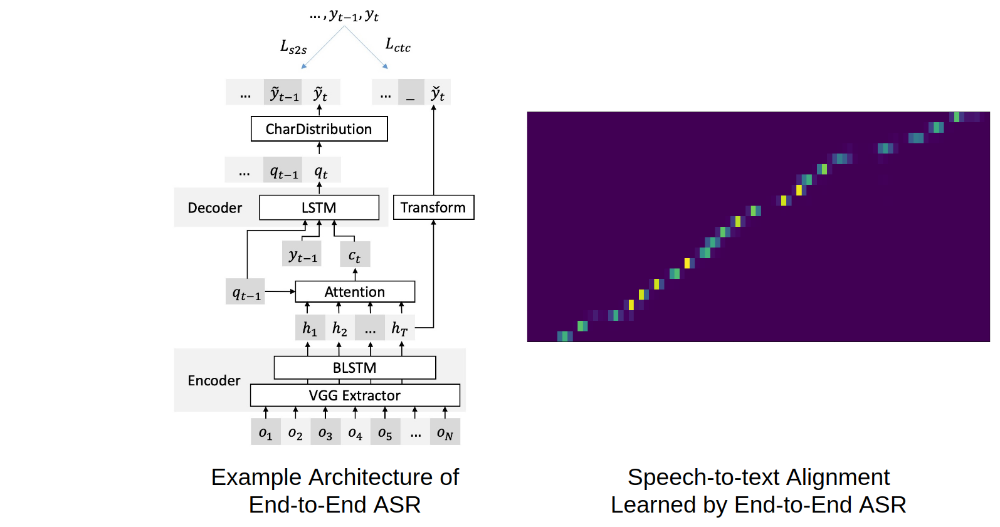

# End-to-end Automatic Speech Recognition Systems - PyTorch Implementation

This is an open source project (formerly named **Listen, Attend and Spell - PyTorch Implementation**) for end-to-end ASR by [Tzu-Wei Sung](https://github.com/WindQAQ) and me.
Implementation was mostly done with Pytorch, the well known deep learning toolkit.

The end-to-end ASR was based on Listen, Attend and Spell<sup>[1](#Reference)</sup>. Multiple techniques proposed recently were also implemented, serving as additional plug-ins for better performance. For the list of techniques implemented, please refer to the [highlights](#Highlights), [configuration](config/) and [references](#Reference).

Feel free to use/modify them, any bug report or improvement suggestion will be appreciated. If you find this project helpful for your research, please do consider to cite [our paper](#Citation), thanks!

## Highlights

<p align="center">
  
</p>

- Feature Extraction
    - On-the-fly feature extraction using torchaudio as backend
    - Character/subword<sup>[2](#Reference)</sup>/word encoding of text

- Training End-to-end ASR 
    - Seq2seq ASR with different types of encoder/attention<sup>[3](#Reference)</sup>
    - CTC-based ASR<sup>[4](#Reference)</sup>, which can also be hybrid<sup>[5](#Reference)</sup> with the former
    - *yaml*-styled model construction and hyper parameters setting
    -  Training process visualization with [TensorBoard](https://www.tensorflow.org/guide/summaries_and_tensorboard), including attention alignment

- Speech Recognition with End-to-end ASR (i.e. Decoding)
    - Beam search decoding
    - RNN language model training and joint decoding for ASR<sup>[6](#Reference)</sup>
    - Joint CTC-attention based decoding<sup>[6](#Reference)</sup>

*You may checkout some example log files with TensorBoard by downloading them from [`coming soon`]()*

## Dependencies

- Python 3
- Computing power (high-end GPU) and memory space (both RAM/GPU's RAM) is **extremely important** if you'd like to train your own model.
- Required packages and their use are listed [requirements.txt](requirements.txt).

## Instructions


### Step 0. Preprocessing - Generate Text Encoder

*You may use the text encoders provided at [`tests/sample_data/`](tests/sample_data/) and skip this step.*

The subword model is trained with `sentencepiece`. As for character/word model, you have to generate the vocabulary file containing the vocabulary line by line. You may also use `util/generate_vocab_file.py` so that you only have to prepare a text file, which contains all texts you want to use for generating the vocabulary file or subword model. Please update `data.text.*` field in the config file if you want to change the mode or vocabulary file. For subword model, use the one ended with `.model` as `vocab_file`.

```shell=zsh
python3 util/generate_vocab_file.py --input_file TEXT_FILE \
                                    --output_file OUTPUT_FILE \
                                    --vocab_size VOCAB_SIZE \
                                    --mode MODE
```
For more details, please refer to `python3 util/generate_vocab_file.py -h`.

### Step 1. Configuring - Model Design & Hyperparameter Setup


All the parameters related to training/decoding will be stored in a yaml file. Hyperparameter tuning and experiments can be managed easily this way. See [documentation and examples](config/) for the exact format. **Note that the example configs provided were not fine-tuned**, you may want to write your own config for best performance.


### Step 2. Training (End-to-end ASR or RNN-LM) 

Once the config file is ready, run the following command to train end-to-end ASR (or language model)
```
python3 main.py --config <path of config file> 
```

For example, train an ASR on LibriSpeech and watch the log with
```shell=zsh
# Checkout options available
python3 main.py -h
# Start training with specific config
python3 main.py --config config/libri/asr_example.yaml
# Open TensorBoard to see log
tensorboard --logdir log/
# Train an external language model
python3 main.py --config config/libri/lm_example.yaml --lm
```

All settings will be parsed from the config file automatically to start training, the log file can be accessed through TensorBoard. ***Please notice that the error rate reported on the TensorBoard is biased (see issue #10), you should run the testing phase in order to get the true performance of model***. 
Options available in this phase include the followings

| Options | Description                                                                                   |
|---------|-----------------------------------------------------------------------------------------------|
| config  | Path of config file. |
| seed    | Random seed, **note this is an option that affects the result**                                         |
| name    | Experiments for logging and saving model. <p> By default it's `<name of config file>_<random seed>` |
| logdir  | Path to store training logs (log files for tensorboard), default `log/`.|
| ckpdir  | The directory to store model, default `ckpt/`.|
| njobs   | Number of workers used for data loader, consider increase this if you find data preprocessing takes most of your training time, default using `6`.|
| no-ping | Disable the pin-memory option of pytorch dataloader. |
| cpu     | CPU-only mode, not recommended, use it for debugging.|
| no-msg  | Hide all message from stdout. |
| lm      | Switch to rnnlm training mode. |
| test    | Switch to decoding mode (do not use during training phase) |
|cudnn-ctc| Use CuDNN as the backend of PyTorch CTC. Unstable, see [this issue](https://github.com/pytorch/pytorch/issues/26797), not sure if solved in [latest Pytorch with cudnn version > 7.6](https://github.com/pytorch/pytorch/commit/f461184505149560803855f3a40d9e0e54c64826)|


### Step 3. Speech Recognition & Performance Evaluation

To test a model, run the following command
```
python3 main.py --config <path of config file> --test --njobs <int>
```
***Please notice that the decoding is performed without batch processing, use more workers to speedup at the cost of using more RAM.***
By default, recognition result will be stored at `result/<name>/` as two csv files with auto-naming according to the decoding config file. `output.csv` will store the best hypothesis provided by ASR and `beam.csv` will recored the top hypotheses during beam search. The result file may be evaluated with `eval.py`. For example, test the example ASR trained on LibriSpeech and check performance with
```
python3 main.py --config config/libri/decode_example.yaml --test --njobs 8
# Check WER/CER
python3 eval.py --file result/asr_example_sd0_dev_output.csv
```

Most of the options work similar to training phase except the followings:

| Options | Description |
|---------|-------------|
| test    | *Must be enabled*|
| config  | Path to the decoding config file.|
| outdir  | Path to store decode result.|
| njobs   | Number of threads used for decoding, very important in terms of efficiency. Large value equals fast decoding yet RAM/GPU RAM expensive.    |


## Troubleshooting 

- Loss becomes `nan` right after training begins
    
    For CTC, `len(pred)>len(label)` is necessary.
    Also consider set `zero_infinity=True` for `torch.nn.CTCLoss`


## ToDo

- Provide examples
- Pure CTC training / CTC beam decode bug (out-of-candidate)
- Greedy decoding
- Customized dataset
- Util. scripts
- Finish CLM migration and reference
- Store preprocessed dataset on RAM

## Acknowledgements 
- Parts of the implementation refer to [ESPnet](https://github.com/espnet/espnet), a great end-to-end speech processing toolkit by Watanabe *et al*.
- Special thanks to [William Chan](http://williamchan.ca/), the first author of LAS, for answering my questions during implementation.
- Thanks [xiaoming](https://github.com/lezasantaizi), [Odie Ko](https://github.com/odie2630463), [b-etienne](https://github.com/b-etienne), [Jinserk Baik](https://github.com/jinserk) and [Zhong-Yi Li](https://github.com/Chung-I) for identifying several issues in our implementation. 

## Reference

1. [Listen, Attend and Spell](https://arxiv.org/abs/1508.01211v2), W Chan *et al.*
2. [Neural Machine Translation of Rare Words with Subword Units](http://www.aclweb.org/anthology/P16-1162), R Sennrich *et al.*
3. [Attention-Based Models for Speech Recognition](https://arxiv.org/abs/1506.07503), J Chorowski *et al*.
4. [Connectionist Temporal Classification: Labelling Unsegmented Sequence Data with Recurrent Neural Networks](https://www.cs.toronto.edu/~graves/icml_2006.pdf), A Graves *et al*.
5. [Joint CTC-Attention based End-to-End Speech Recognition using Multi-task Learning](https://arxiv.org/abs/1609.06773), S Kim *et al.* 
6.  [Advances in Joint CTC-Attention based End-to-End Speech Recognition with a Deep CNN Encoder and RNN-LM](https://arxiv.org/abs/1706.02737), T Hori *et al.* 

## Citation

```
@inproceedings{liu2019adversarial,
  title={Adversarial Training of End-to-end Speech Recognition Using a Criticizing Language Model},
  author={Liu, Alexander and Lee, Hung-yi and Lee, Lin-shan},
  booktitle={Acoustics, Speech and Signal Processing (ICASSP)},
  year={2019},
  organization={IEEE}
}

@misc{alex2019sequencetosequence,
    title={Sequence-to-sequence Automatic Speech Recognition with Word Embedding Regularization and Fused Decoding},
    author={Alexander H. Liu and Tzu-Wei Sung and Shun-Po Chuang and Hung-yi Lee and Lin-shan Lee},
    year={2019},
    eprint={1910.12740},
    archivePrefix={arXiv},
    primaryClass={cs.CL}
}
```
